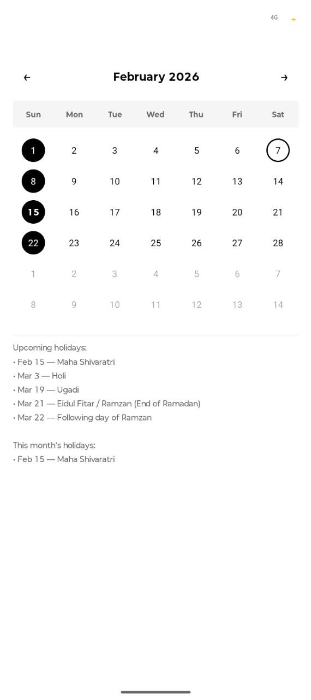
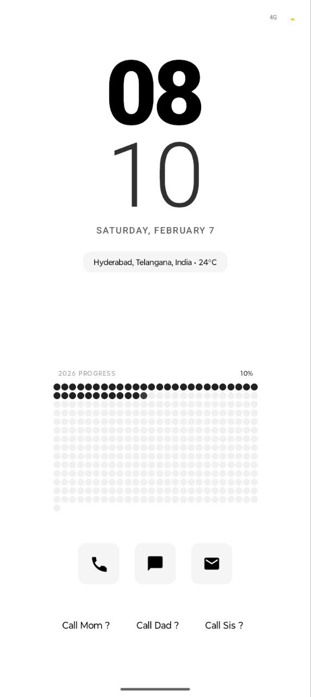
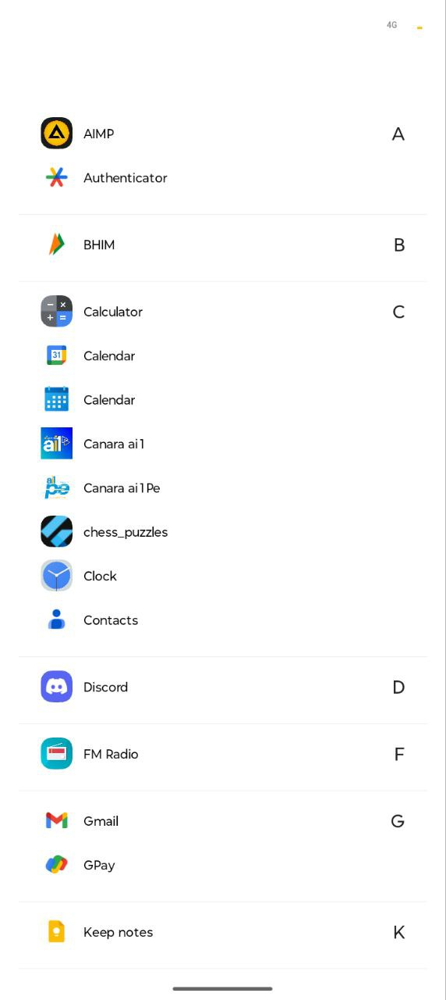

# Live

Minimalistic Android Launcher

## Installation / Download

- Download the latest APK from the Releases page: https://github.com/naniisnani2021/live/releases
- Or build from source:
  1. Open the project in Android Studio.
  2. Build and run the `app` module on an emulator or device.

---

